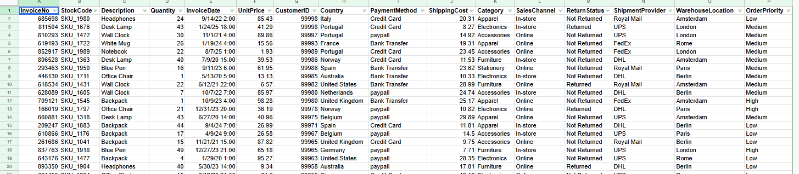
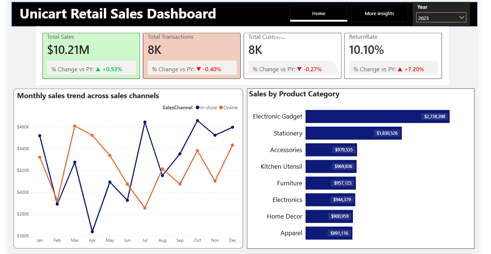

# Unicart Retail Group Sales Performance Report (2020 - 2025)

## Executive Summary
This analysis evaluates Unicart Retail Group’s sales performance from 2020 - 2025. It identifies patterns in monthly sales trends, provides insights into sales performance by product category and sales method and highlights key growth drivers as well as areas of concern such as sales, orders, customers and return rates.

## Business Context
Unicart Retail Group’s management requires clear, data-driven reporting of their sales performance at the transaction level. The objective is to understand performance in order to support informed business decisions and optimize operations.

## Objectives
This report addresses the following key questions:
 - What are the Key Performance Indicators (KPIs), and how have they changed over the years?
 - Which product categories and geographical locations are driving sales, and which are lagging?
 - What are the preferred payment channels for customers?

## Data Overview
The analysis is based on a consolidated dataset of approximately 49,000 transactions and 16 columns, covering January 2020 to September 2025. It represents customer orders across all current operating locations.

## Data Preview

## Key Findings
 - Average annual sales are approximately $10M.
 - Annual sales have shown a consistent increase, except in 2022, when there was a 1.18% decline.
 - Products in the Electronic Gadget category contribute significantly more to sales than other categories.
 - Customer preference for payment methods is balanced, with nearly equal distribution among Credit Card, Bank Transfer, and PayPal.

## Dashboard 

## Link to Power BI Report
[Click here](https://app.powerbi.com/view?r=eyJrIjoiN2NhODdmMjgtMzQwYy00OWU1LTlhODItMTdjZjFlMTVmYjg4IiwidCI6IjQ0MWExMDJhLTNhMTItNGViZi1hOTM0LTU4YTQxZDkwNjc3OSJ9)

## Data Cleaning and Transformation
 - Removed duplicate entries from the Invoice No column.
 - Identified and removed approximately 3,000 null values from the Warehouse Location column.
 - Corrected and standardized the Product Category column.
 - Standardized the Payment Method column by renaming “paypall” to “PayPal.”
 - Calculated new SalesAmount and PaymentAmount columns.

## Detailed Findings & Analysis
### Key Performance Indicators (YoY Change)
 - Total sales exceeded $58M during the review period.
 - Average annual sales are approximately $10M.
 - Sales declined by 1.18% in 2022 compared to 2021.
 - The return rate, which increased by 7.2% in 2023, has since declined consistently, reaching -1.87% as of September 2025.
   
### Sales Distribution by Product Category
 - Electronic gadgets consistently outsell all other product categories. In 2025, sales reached $1.9M, exceeding Stationery by $600,000.
 - Apparel, Kitchen Utensil, Furniture, Electronics, Accessories and Home decor contribute similar sales, ranging from $600K to $660K in 2025.

### Sales Amount by Payment Method
 - Customer payment preferences are closely balanced: Credit Card (33%), Bank Transfer (34%), and PayPal (33%).
 - This pattern has remained consistent year over year, showing no significant dominance of one payment method.

### Monthly Sales Trend
 - In-store and online sales trends vary across years.
 - In 2022 and 2023, in-store sales dipped in April and peaked in October.
 - In 2024, the pattern reversed, peaking in April and dipping in October.
 - In 2025, both channels moved in the same direction with minimal variation.
 - There is no consistent, predictable pattern between the two sales channels.

### Sales by Country
 - Sales across countries are closely aligned, with no significant outliers.
 - In 2025, Norway recorded the highest sales ($650K), followed by the UK ($640K). Australia recorded the lowest at $495K.
 - This pattern of closely clustered sales values has remained consistent over the years.

## Recommendations
 - Continue implementing policies introduced in 2024, which have successfully reduced the high return rate recorded in 2023.
 - Promote products in Apparel, Kitchen Utensil, Furniture, Electronics, Accessories and Home decor categories, as they consistently underperform compared to others.  - - - Increased promotions and visibility will be beneficial.
 - Expand efforts in the US market, where performance has remained relatively flat over the past five years. Greater awareness and presence in this market could significantly boost sales.

## Tools Used
 - **Power Query:** Data cleaning and transformation
 - **Power BI:** Data analysis and visualization

## Conclusion
Unicart Retail Group has maintained steady sales growth from 2020–2025, with strong contributions from the Electronic Gadget category and balanced customer preferences across payment methods. While return rates have improved since 2023, underperforming product categories and the untapped potential in the US market present clear opportunities for growth. Strengthening these areas will position Unicart Retail Group for sustained performance in the years ahead.

